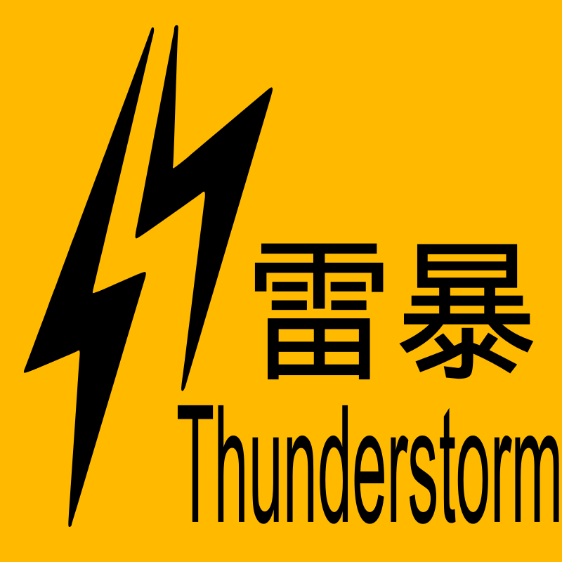
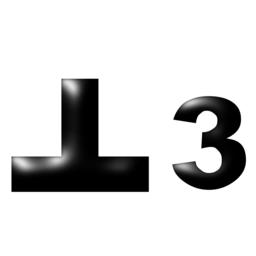

# Hong Kong Observatory Weather Warning Symbols

Reimplemented from scratch as SVG files.

*Note: After rendering, the results are not pixel perfect to the originals. Instead, a
best effort is made to be as close as reasonably possible using basic Inkscape
features.*

This repo contains source SVG files in the `src` folder. It also includes
stripped plain SVGs in the `svg` folder. These files have Inkscape specific
extensions removed and text converted to paths.

## Prerequisites for export script
* Inkscape
* ImageMagick

## Fonts required for rendering

* Arial
* Arial Heavy
* Arial Narrow
* Arial Rounded MT
* Arial Rounded MT Bold
* Microsoft YaHei
* MKai HK
* Yu Gothic

## Preview
<!--

-->

